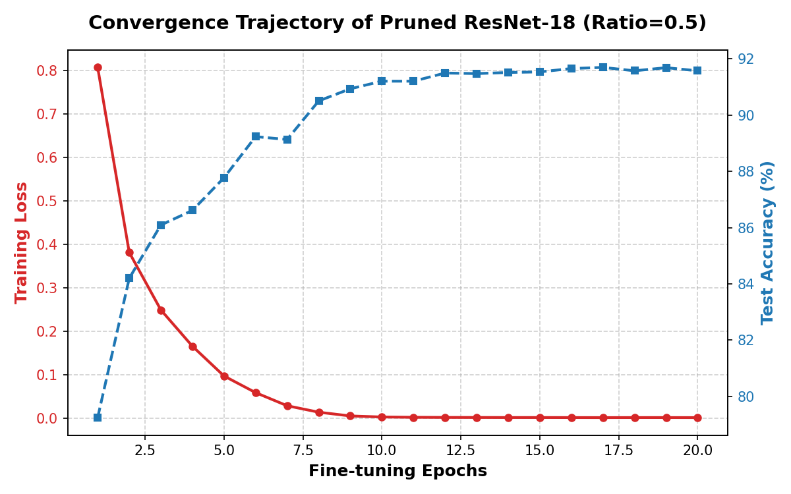
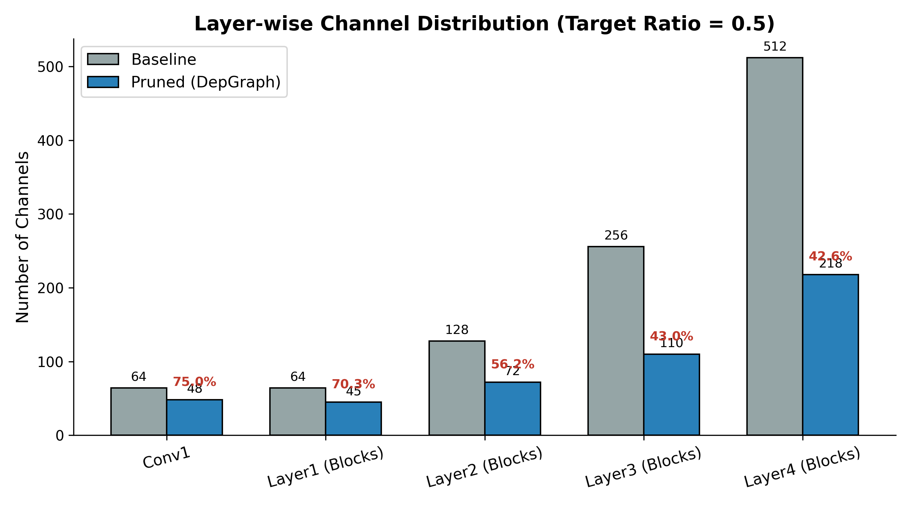
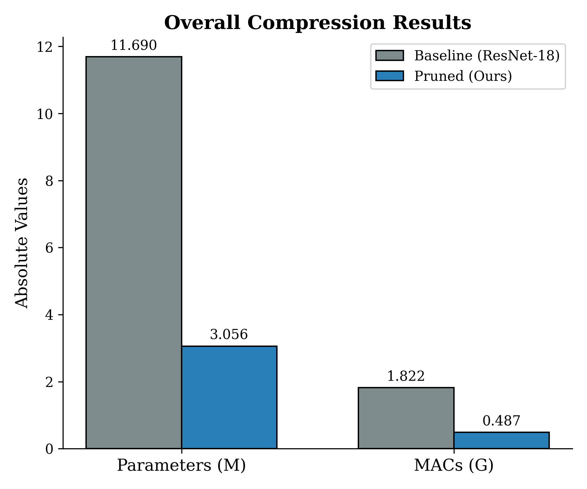

# Structural Pruning of ResNet-18 using Dependency Graph (DepGraph)

[](https://pytorch.org/)
[](https://opensource.org/licenses/MIT)
[]()

> An independent reproduction study applying the Dependency Graph (DepGraph) framework to resolve structural disruptions during the pruning of residual networks.

## 📖 Abstract
The deployment of deep Convolutional Neural Networks (CNNs) on edge devices is often hindered by immense computational costs. While structural pruning physically removes entire filters or channels, applying it to architectures like ResNet presents a fundamental challenge: **residual connections require strict dimension alignment**. 

This project reproduces the **DepGraph** framework (CVPR 2023), which explicitly models the dependency between layers and comprehensively groups coupled parameters for pruning. By employing an L1-norm magnitude importance criterion with a target pruning ratio of 0.5, this pipeline successfully achieves a massive reduction in MACs and parameters while preserving the critical feature-extraction pathways of the network.

## 🚀 Key Results

The pruning operation was executed on a pre-trained ResNet-18 model. After structural pruning, a post-pruning fine-tuning phase was initiated on the CIFAR-10 dataset. 

* **Computational Compression:** Reduced MACs by **73.26%** (from 1.822 G to 0.487 G).
* **Parameter Reduction:** Compressed total parameters by **73.86%** (from 11.690 M to 3.056 M).
* **Accuracy Recovery:** Rapidly restored test accuracy from random initialization to **91.69%** within 20 epochs, demonstrating robust "network muscle memory".

### Overall Compression Metrics
*(Make sure `figure1_compression.png` is uploaded to your repo)*


### Layer-wise Channel Distribution
The DepGraph algorithm exhibits a non-uniform pruning behavior, aggressively reducing redundancy in deeper layers while preserving critical low-level feature extractors.


### Fine-Tuning Convergence Trajectory


## 🛠️ Quick Start

### 1. Requirements
```bash
pip install torch torchvision torch-pruning matplotlib tqdm
